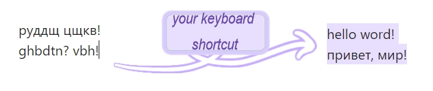

# Switch Layout

  plugin for changing the layout of already printed text ([CorniLemon/switch-layot: switch the layout of the already written text (github.com)](https://github.com/CorniLemon/switch-layot))

a plugin to turn your "*руддщ цщкдв*" into "*hello world*" and back!

### for work: 
1. install and enable the plugin
2. Set up the keyboard shortcuts
3. Select the text whose layout you want to change
4. Press the selected keyboard shortcuts

### Demo:

**What languages does it work with?**
- Russian
- English

**plugin roadmap:**
*1.0.1* - added processing of the characters 'б', 'ю', 'ж', 'э', 'х', 'ъ', 'ё'.
there is a difficulty with processing the characters '.' and ',', please check the corrected text
*1.0.0* - is the minimum working version

